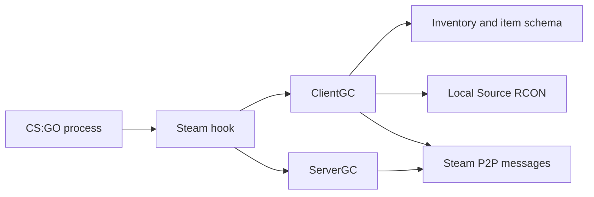

# Architecture

csgo_gc redirects Steam Game Coordinator traffic into local C++ implementations that live inside the CS:GO process.

## High-level flow



## Steam hook

`steam_hook.cpp` intercepts the Steam API and Game Coordinator message flow. It decides whether a message should be handled locally, passed to the local ClientGC or ServerGC, or proxied to the original Steam interface.

The exported entry point is:

```cpp
InstallGC(bool dedicated)
```

This initializes the platform layer and installs the Steam hook.

## ClientGC

The ClientGC path handles most player-facing GC behavior:

- Client hello and welcome.
- Inventory cache subscription.
- Loadout and equipped item changes.
- Item use and customization flows.
- Store user data and purchase responses.
- RCON command execution.
- Client-side networking messages for lobbies and servers.

## ServerGC

The ServerGC path handles dedicated-server-facing GC behavior:

- Server hello and welcome.
- Client SO cache forwarding.
- SO cache validation and cleanup.
- Music kit MVP state forwarding.
- Selected kill count propagation.

## Inventory and schema

`inventory.cpp` owns local inventory state and persistence. It works together with `item_schema.cpp` to interpret defindexes, paint kits, stickers, rarity, quality, crate contents, trade-up candidates, and attribute encoding.

The inventory file path is:

```text
csgo_gc/inventory.txt
```

## RCON

`rcon_server.cpp` implements a Source RCON-compatible TCP listener. It does not implement raw newline commands. After Source RCON authentication, commands are routed into the active ClientGC instance.

## Networking

`networking_client.cpp`, `networking_server.cpp`, and `networking_shared.h` implement the project-specific Steam P2P message path used by csgo_gc clients and servers.
