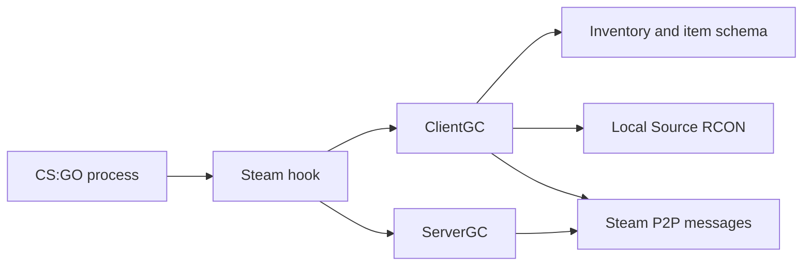

# Architecture

csgo_gc redirects Steam Game Coordinator traffic into local C++ implementations that live inside the CS:GO process.

## High-level flow


```mermaid
flowchart LR
    Game["CS:GO process"] --> Hook["Steam hook"]
    Hook --> Client["ClientGC"]
    Hook --> Server["ServerGC"]
    Client --> Inventory["Inventory and item schema"]
    Client --> RCON["Local Source RCON"]
    Client --> Net["Steam P2P messages"]
    Server --> Net
```

## Steam hook

`steam_hook.cpp` intercepts the Steam API and Game Coordinator message flow. It decides whether a message should be handled locally, passed to the local ClientGC or ServerGC, or proxied to the original Steam interface.

The exported entry point is:

```cpp
InstallGC(bool dedicated)
```

This initializes the platform layer and installs the Steam hook.

## Final-client and upstream compatibility

The primary runtime target is the final September 2023 legacy CS:GO client. The hook preserves the `ISteamGameCoordinator` boundary and the shared CS:GO protobuf message formats. Current compatibility work covers client hello/welcome, SOCache version negotiation and refresh, class-specific loadout changes, default-item swaps, and the in-game store checkout flow.

Interoperability with the original upstream project is scoped to features both implementations support. Shared client/server messages should continue to work in either direction. Fork-only state is additive and should be ignored by an implementation that does not understand it, but this is not a guarantee of complete feature parity.

The store flow has several ordering requirements:

1. Purchase initialization validates all line items and reserves the single active transaction.
2. The Steam authorization callback is delayed until a later callback pass so the client has stored the transaction ID.
3. Finalization creates and publishes inventory SO objects before returning success. A partial creation failure rolls back unpublished items and clears the pending transaction.

## ClientGC

The ClientGC path handles most player-facing GC behavior:

- Client hello and welcome.
- Inventory cache subscription.
- Loadout and equipped item changes.
- Item use and customization flows.
- Store user data and purchase responses.
- RCON command execution.
- Client-side networking messages for lobbies and servers.

## ServerGC

The ServerGC path handles dedicated-server-facing GC behavior:

- Server hello and welcome.
- Client SO cache forwarding.
- SO cache validation and cleanup.
- Music kit MVP state forwarding.
- Selected kill count propagation.

## Music kit StatTrak

Music kit StatTrak counts round MVPs on an equipped StatTrak music kit and shows the count on the MVP panel through the `musickitmvps` field of the `round_mvp` event.

The official backend advanced this counter on the gameserver and published it. That path is gone: the final `server.dll` no longer computes the value, and the helper that queued the increment has no callers. The game's own machinery cannot supply it, so the project supplies it instead.

When the client observes a local `round_mvp` it increments the counter in its inventory and mirrors it into the event, and it also tells the connected server through `k_EMsgNetworkMusicKitMVPState`. The server tracks the counter from the client's own SO cache messages as well, so a server running this project publishes the value itself. A client connecting to a server without this project still gets the counter locally.

`musickitmvps` is a declared field of `round_mvp` in the game's event definitions, so the stock HUD renders the count with no client-side change.

The feature is gated on a competitive ruleset through `MusicKit::ShouldTrackStatTrak`, evaluated on every publish so a mid-session game mode change is respected. The gate replaces the retired official `IsQueuedMatchmaking` signal, which only matched Valve matchmaking reservation servers. `game_types.cpp` reads the game's own `IGameTypes` interface for the current game type and mode. Gating on the client means the counter is not inflated in modes that never counted, and gating on the server means the event carries no music kit data in those modes.

## Inventory and schema

`inventory.cpp` owns local inventory state and persistence. It works together with `item_schema.cpp` to interpret defindexes, paint kits, stickers, rarity, quality, crate contents, trade-up candidates, and attribute encoding.

The inventory file path is:

```text
csgo_gc/inventory.txt
```

## RCON

`rcon_server.cpp` implements a Source RCON-compatible TCP listener. It does not implement raw newline commands. After Source RCON authentication, commands are routed into the active ClientGC instance.

## Networking

`networking_client.cpp`, `networking_server.cpp`, and `networking_shared.h` implement the project-specific Steam P2P message path used by csgo_gc clients and servers.
