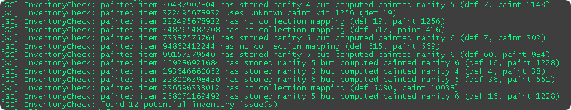

# Inventory

csgo_gc stores the local inventory in `csgo_gc/inventory.txt`.

The file uses Valve-style KeyValues. It is powerful, but easy to break by hand. Keep backups before editing.

::: tip
Using a GUI editor is recommended for inventory editing. For available GUI editors, see [mikkokko/csgo_gc Issue #82](https://github.com/mikkokko/csgo_gc/issues/82).
:::

## What the inventory supports

The current implementation supports:

- Weapons, knives, cosmetics, stickers, patches, graffiti, music kits, and Storage Units.
- Equipped state and equipment updates.
- Paint kits, paint seed, wear, rarity, quality, item level, and custom names.
- StatTrak weapon and music kit counters.
- Inventory Storage Component deposit and withdraw flows.
- Trade-up inputs and generated outputs.

## Offline editing

Offline editing means changing `inventory.txt` while the game is closed, then restarting CS:GO. This is still the most convenient way to make large manual changes.

The basic structure is:

```text
"items"
{
    "2"
    {
        "inventory" "1"
        "def_index" "507"
        "level"     "1"
        "quality"   "99"
        "rarity"    "6"
        "attributes"
        {
            "6" "38.000000"
            "7" "41.000000"
            "8" "0.000001"
        }
    }
}
```

`default_equips` stores fallback equipment choices by class and slot.

## Inventory format checks



At startup, the GC checks the inventory format and reports problems in the console. These problems do not prevent you from playing or using the inventory, but adjusting the data based on the logs is still recommended.

## Live editing

For live changes while the game is running, use the local RCON interface. It can create and remove items while the game is open and then send live GC updates to the game.

Use RCON for tools, scripts, and quick tests.

GUI editors that currently support RCON editing:

- [GT-610/csgo-gc-inventory-editor](https://github.com/GT-610/csgo-gc-inventory-editor)

## Store data

The in-game store reads from:

```text
csgo_gc/price_sheet.txt
```

The example price sheet was dumped from a 2022-era data set. It contains store layout, product links, prices, sale prices, and store metadata used by the local GC responses.
