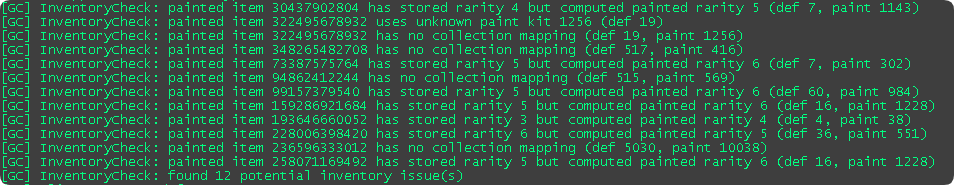

# Inventory

csgo_gc stores the local inventory in `csgo_gc/inventory.txt`.

The file uses Valve-style KeyValues. It is powerful, but easy to break by hand. Keep backups before editing.

::: tip
Using a GUI editor is recommended for inventory editing. For available GUI editors, see [mikkokko/csgo_gc Issue #82](https://github.com/mikkokko/csgo_gc/issues/82).
:::

## What the inventory supports

The current implementation supports:

- Weapons, knives, cosmetics, stickers, patches, graffiti, music kits, and Storage Units.
- Equipped state and equipment updates.
- Paint kits, paint seed, wear, rarity, quality, item level, and custom names.
- StatTrak weapon and music kit counters.
- Inventory Storage Component deposit and withdraw flows.
- Trade-up inputs and generated outputs.

## Offline editing

Offline editing means changing `inventory.txt` while the game is closed, then restarting CS:GO. This is still the most convenient way to make large manual changes.

The basic structure is:

```text
"items"
{
    "2"
    {
        "inventory" "1"
        "def_index" "507"
        "level"     "1"
        "quality"   "99"
        "rarity"    "6"
        "attributes"
        {
            "6" "38.000000"
            "7" "41.000000"
            "8" "0.000001"
        }
    }
}
```

`default_equips` stores fallback equipment choices by class and slot.

## Inventory format checks



At startup, the GC checks the inventory format and reports problems in the console. These problems do not stop you from playing or using the inventory, but it is still worth cleaning up whatever the logs point at.

## Live editing

For live changes while the game is running, use the local RCON interface. It can create and remove items while the game is open and then send live GC updates to the game.

Use RCON for tools, scripts, and quick tests.

GUI editors that currently support RCON editing:

- [GT-610/csgo-gc-inventory-editor](https://github.com/GT-610/csgo-gc-inventory-editor)

## Store prices and purchase controls

The in-game store reads:

```text
csgo_gc/price_sheet.txt
```

The example price sheet contains the store layout, product links, prices, sale prices, and metadata used by local GC responses. Prices are delivered by the local GC at runtime, so restart the game after changing the file.

Store purchases are simulated locally. They do not charge Steam Wallet funds and do not add items to the official Steam inventory. The local GC accepts one checkout at a time and delivers successful purchases directly to the local SOCache, so the new items should appear without restarting the game.

If a key entry is missing from the price sheet, Panorama may hide the purchase bar before sending a purchase request. This is a price-sheet data problem, not an inventory or case-opening protocol problem. If an item cannot be purchased because price data is missing, [report an issue](https://github.com/GT-610/csgo-gc/issues/new).

The example file comes from a public multi-currency snapshot dated May 5, 2023. It includes later CS:GO store entries such as Revolution Case, Anubis, and Paris 2023, but is not Valve's original price sheet from before CS:GO was delisted on September 27, 2023.
