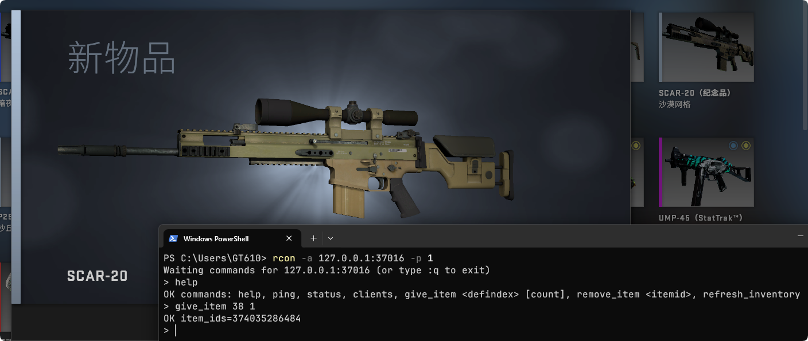

# RCON

CSGO-GC exposes an optional Source RCON-compatible control port for the local ClientGC. It is intended for scripting, debugging, GUI inventory editors, and quick live inventory tests. More useful RCON commands for servers may be added later.



::: warning
The GC RCON and the Dedicated Server RCON on port `27016` are **independent** of each other.
:::

RCON is disabled by default.

## Enable RCON

Add or edit the `rcon` block in `csgo_gc/config.txt`:

```text
"rcon"
{
    "enabled"      "1" // 1 enables RCON, 0 disables it
    "bind_address" "127.0.0.1" // RCON listen address
    "port"         "37016" // RCON listen port
    "password"     "" // Password
}
```

Restart the game after changing this file.

::: danger Security
Keep RCON on `127.0.0.1` unless you have added your own network protection. RCON can mutate your local inventory state.

If the configured password is empty, **any supplied password will be accepted** for compatibility with Source RCON clients.
:::

## Protocol

The listener speaks the Source RCON binary protocol:

- Little-endian size-prefixed packets.
- `SERVERDATA_AUTH` for authentication.
- `SERVERDATA_EXECCOMMAND` for commands.
- `SERVERDATA_RESPONSE_VALUE` and `SERVERDATA_AUTH_RESPONSE` for responses.

Raw newline text mode is not supported.

## Basic checks

```powershell
Test-NetConnection 127.0.0.1 -Port 37016
```

With a Source RCON client:

```powershell
rcon -a 127.0.0.1:37016 -p 1 ping
```

Expected response:

```text
OK pong
```

## Response format

Responses are plain text inside Source RCON response packets:

```text
OK <message>
ERR <message>
```

## Commands

| Command | Purpose |
| --- | --- |
| `help` | Lists available commands. |
| `ping` | Returns `OK pong`. |
| `status` | Shows RCON and ClientGC state. |
| `clients` | Lists the controllable local ClientGC. |
| `give_item` | Creates inventory items and sends live create updates. |
| `remove_item` | Removes an item and sends a live destroy update. |
| `refresh_inventory` | Resends the full inventory cache subscription. |
| `list_items` | Lists items in stable item-ID order; default 50, maximum 500. |
| `find_item` | Searches exact IDs, defindexes, display names, and custom names. |
| `item_info` | Shows item attributes and equipped state. |
| `save_inventory` | Saves the in-memory inventory to `csgo_gc/inventory.txt`. |

Large responses include `total`, `shown`, and `truncated`. `truncated=1` means the single Source RCON response packet reached its output limit; narrow the query rather than treating the inventory as incomplete.

`refresh_inventory` is a repair/debug command that resends the full cache subscription. It is not the normal path for creating an item.

## Create items

```text
give_item <defindex> [count] [key=value...]
```

Examples:

```text
give_item 7
give_item 7 5
give_item 7 paint=44
give_item 7 paint=44 wear=0.12 seed=123 stattrak=5
give_item 7 paint=44 name="RCON Test"
give_item 1314 music=3 stattrak=10
give_item 7 paint=44 sticker0=12 sticker0_wear=0
```

Supported parameters include:

| Parameter | Notes |
| --- | --- |
| `level` | Item level override. |
| `quality` | Item quality override. |
| `rarity` | Item rarity override. |
| `name` | Custom item name. Quote values containing spaces. |
| `paint` | Paint kit defindex. |
| `seed` | Paint seed. |
| `wear` | Paint wear from `0.0` to `1.0`. |
| `stattrak` | Kill count. `stattrak=1` creates StatTrak with zero kills. |
| `music` | Music definition ID. Requires music kit defindex `1314`. |
| `spray_color` | Graffiti tint ID. |
| `spray_remaining` | Remaining graffiti uses. |
| `sticker0` through `sticker5` | Sticker kit defindex. |
| `stickerN_wear` | Sticker wear from `0.0` to `1.0`. |
| `stickerN_scale` | Sticker scale. |
| `stickerN_rotation` | Sticker rotation. |

`count` is optional and must be between `1` and `100`.

## Remove items

```text
remove_item <itemid>
```

## Common errors

```text
ERR no client gc
ERR unknown defindex
ERR unknown paint
ERR unknown music
ERR unknown sticker
ERR item not found
ERR usage: give_item <defindex> [count] [key=value...]
ERR invalid parameter wear
```

`ERR no client gc` means the listener is running, but the local ClientGC has not registered yet or has already shut down.

## GUI editing

GUI editors that currently support RCON editing:

- [GT-610/csgo-gc-inventory-editor](https://github.com/GT-610/csgo-gc-inventory-editor)

## Souvenir parameters

`give_item` also accepts `tournament_event`, `tournament_stage`, `tournament_team0`, `tournament_team1`, and `tournament_mvp`. See [Souvenir Packages](souvenirs) for the attribute mapping and historical sticker formats.