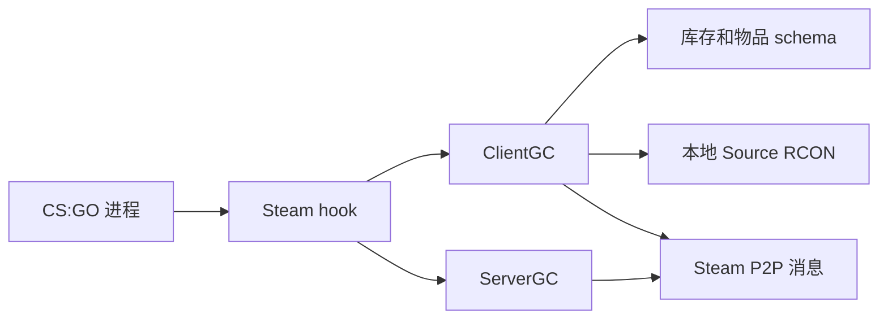

# 架构

csgo_gc 会把 Steam Game Coordinator 流量重定向到运行在 CS:GO 进程内的本地 C++ 实现。

## 高层流程



## Steam hook

`steam_hook.cpp` 拦截 Steam API 和 Game Coordinator 消息流。它决定一条消息应由本地处理、交给本地 ClientGC 或 ServerGC，还是代理给原始 Steam 接口。

导出的入口点是：

```cpp
InstallGC(bool dedicated)
```

它会初始化平台层并安装 Steam hook。

## ClientGC

ClientGC 路径处理大多数玩家可见的 GC 行为：

- Client hello 和 welcome。
- 库存缓存订阅。
- 负载和已装备物品变更。
- 物品使用和自定义流程。
- 商店用户数据和购买响应。
- RCON 命令执行。
- 大厅和服务器相关的客户端网络消息。

## ServerGC

ServerGC 路径处理面向专用服务器的 GC 行为：

- Server hello 和 welcome。
- 客户端 SO cache 转发。
- SO cache 验证和清理。
- 音乐盒 MVP 状态转发。
- 部分击杀计数传播。

## 库存和 schema

`inventory.cpp` 负责本地库存状态和持久化。它与 `item_schema.cpp` 配合解释 defindex、涂装、贴纸、稀有度、品质、箱子内容、汰换候选，以及属性编码。

库存文件路径是：

```text
csgo_gc/inventory.txt
```

## RCON

`rcon_server.cpp` 实现了 Source RCON 兼容的 TCP 监听器。它不支持原始换行文本命令。完成 Source RCON 认证后，命令会被路由到当前活动的 ClientGC 实例。

## 网络

`networking_client.cpp`、`networking_server.cpp` 和 `networking_shared.h` 实现了 csgo_gc 客户端与服务器之间使用的项目专用 Steam P2P 消息路径。
