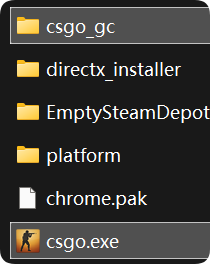

# 客户端安装

::: danger
由于本程序通过钩子函数将游戏的 GC 流量重定向到本地，某些杀毒软件（例如*火绒*）会误报为 ShellLoader 或 Trojan 一类的恶意程序。

本项目完全自由且开源，只要你确保你的下载来源是 [我们的 GitHub Release 页面](https://github.com/GT-610/csgo-gc/releases)，我们保证是绝对安全的。

如果你不放心，你也可以自行检索代码库，或者向 AI 询问代码库是否安全，或者自行编译。

**一定不要**从其他任何来源下载本项目！

:::

## 要求

- 拥有修改游戏安装目录的权限。

## 安装旧版 CS:GO

通过 Steam 商店安装旧版 CS:GO 应用。您可在 Steam 商店直接搜索，或通过[此链接](https://store.steampowered.com/app/4465480/CounterStrikeGlobal_Offensive/)进入商店页面。

## 安装 csgo_gc

1. [下载](https://github.com/GT-610/csgo-gc/releases)适合你平台的最新发布包。
2. 打开 CS:GO 安装目录：库 - 右键 Counter-Strike:Global Offensive - 管理 - 浏览本地文件
3. 备份原始启动器可执行文件，例如 `csgo.exe` 或者 `csgo_linux64`。
4. 将发布包中的 `csgo_gc` 文件夹和对应的启动器可执行文件解压到游戏目录。
5. 按提示替换文件。
6. 正常启动游戏。如果游戏显示“VAC 不安全”对话框，请添加 `-steam` 启动参数。

如果一切正常，你会在控制台看到绿色的带有 `[GC]` 字样的日志输出，同时你会顺利进入大厅和库存页面，你也可以在库存看到一个“爪子刀 - 渐变之色”物品。

## macOS 说明

macOS 可能会弹出权限而阻止运行，这需要你通过系统安全流程手动允许。

## 接下来？

查看[配置](/zh/user/configuration)页面了解如何添加和管理库存。
